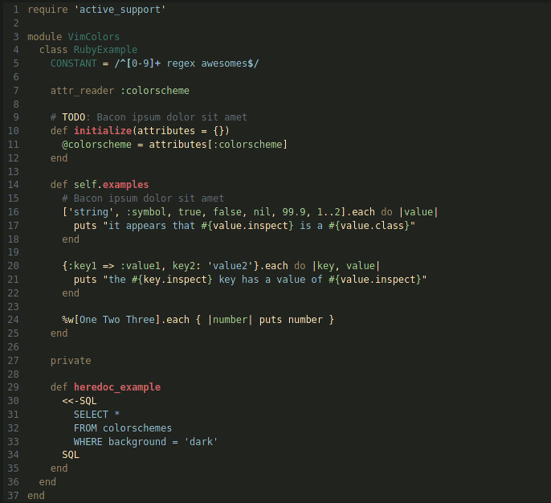

# Hypsteria
A green-ish low constrast retro' color scheme for VIM inspired by gruvbox, 
darcula and solarized.  


> Image from [Vim Colors](https://vimcolors.com)
  
### Installation <br>
---

#### Manual:
- clone the repo and put the ```Hypsteria.vim``` file in the ```~/.vim/colors``` folder  

#### VIM Plug:
- Add  
```Plug 'J4CKR3D/Hypsteria'```
to your .vimrc (if you're more of a GitHub guy)  

or:
- Add
```Plug 'https://gitlab.com/A7l4S/Hypsteria```
to your .vimrc (if you're more of a GitLab guy)  
  
  
  
#### Tips:
- Enjoy with coffee.
